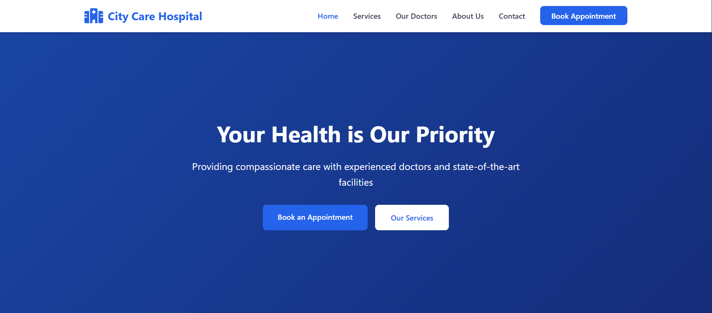
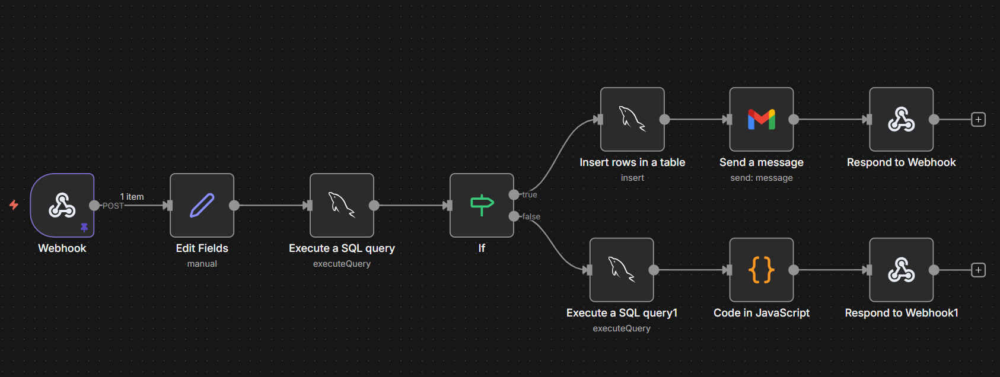

# 🏥 MediBook Appointment System

A full-stack hospital appointment booking system that provides real-time slot availability, automated email confirmations, and intelligent alternative appointment suggestions.


---

## 📌 Overview

MediBook simplifies hospital appointment scheduling by offering patients an easy booking experience while automatically managing slot availability and sending confirmation emails using workflow automation.

---

## ✨ Key Features

* Multi-step booking form with real-time validation
* Real-time appointment slot availability checking
* Smart alternative slot recommendations
* Automated HTML email confirmations via Gmail
* Fully responsive design for all devices

---

## 🛠 Tech Stack

| Layer         | Technology                     |
| ------------- | ------------------------------ |
| Frontend      | HTML5, CSS3, JavaScript (ES6+) |
| Backend       | n8n Workflow Automation        |
| Database      | MySQL                          |
| Email Service | Gmail API                      |

---

## 📸 Screenshots

### Homepage



### Multi-step Booking Form


### Success Confirmation


### n8n Workflow Architecture



---

## 📂 Project Structure

```
medibook-appointment-system/
│
├── database/
│   └── schema.sql
│
├── frontend/
│   ├── config/
│   │   └── config.js
│   │
│   ├── css/
│   │   ├── appointment.css
│   │   └── style.css
│   │
│   ├── js/
│   │   ├── appointment.js
│   │   └── main.js
│   │
│   ├── appointment.html
│   └── index.html
│
├── n8n-workflow/
│   └── appointment-workflow.json
│
├── screenshots/
│
├── .gitignore
└── README.md
```

---

## 🚀 Quick Start

### ✅ Prerequisites

* Node.js v14 or higher
* MySQL v5.7 or higher
* n8n (latest version)
* Gmail account with App Password enabled

---

### ⚙️ Installation

#### 1️⃣ Clone Repository

```bash
git clone https://github.com/adigavhane1013/medibook-appointment-system.git
cd medibook-appointment-system
```

---

#### 2️⃣ Setup Database

```bash
mysql -u root -p < database/schema.sql
```

---

#### 3️⃣ Configure n8n

Install n8n globally:

```bash
npm install n8n -g
```

Start n8n:

```bash
n8n start
```

Then:

* Import workflow from:

  ```
  n8n-workflow/appointment-workflow.json
  ```
* Add MySQL credentials
* Add Gmail API credentials

---

#### 4️⃣ Start Frontend Server

```bash
cd frontend
python -m http.server 8000
```

Open in browser:

```
http://localhost:8000
```

---

## 🔄 Workflow Architecture

The booking process is handled using **n8n automation**.

### Booking Flow

1. Receives appointment data via webhook
2. Validates and formats input data
3. Checks MySQL database for slot availability

### If Slot is Available

* Insert appointment into database
* Send confirmation email
* Return success response

### If Slot is Booked

* Calculate alternative slots
* Return error response with suggestions

---

## 🔌 API Response Format

### ✅ Success Response

```json
{
  "success": true,
  "message": "Appointment booked successfully!",
  "appointmentId": "12345"
}
```

---

### ❌ Slot Already Booked

```json
{
  "success": false,
  "message": "This slot is already booked!",
  "alternatives": [
    { "date": "2026-02-20", "time": "10:30 AM" },
    { "date": "2026-02-20", "time": "11:00 AM" }
  ]
}
```

---

## 🗄 Database Schema

The system uses a single **appointments** table containing:

### Patient Information

* Name
* Phone
* Email
* Age

### Medical Details

* Specialization
* Disease description

### Appointment Details

* Doctor
* Appointment date
* Appointment time
* Status

### System Fields

* Created timestamps
* Indexed fields for fast slot availability checks

---

## ✅ Features Implemented

* Frontend and backend form validation
* Real-time slot availability checking
* Alternative slot calculation logic
* Automated HTML email notifications
* MySQL-based data persistence
* Error handling and user feedback
* Mobile responsive UI

---

## 🔮 Future Enhancements

* SMS notifications using Twilio
* Patient dashboard (view / cancel bookings)
* Doctor dashboard with daily schedules
* Admin analytics panel
* Payment gateway integration
* Video consultation support

---

## 🧪 Testing Guide

### ✔ Successful Booking

* Fill form with valid details
* Select an available slot
* Verify success message and email confirmation

### ✔ Double Booking Prevention

* Book a slot
* Attempt booking same slot again
* Verify alternative slot suggestions appear

### ✔ Validation Testing

* Submit invalid data
* Confirm appropriate validation errors appear

---

## 🤝 Contributing

Contributions are welcome:

1. Fork the repository
2. Create a feature branch
3. Submit a pull request

---

## 📜 License

This project is licensed under the MIT License.

---

## 👨‍💻 Author

**Aditya Gavhane**

GitHub: [https://github.com/adigavhane1013](https://github.com/adigavhane1013)

---

## 🙏 Acknowledgments

Built using n8n workflow automation, MySQL database, and Gmail API.

---

## ⭐ Support

